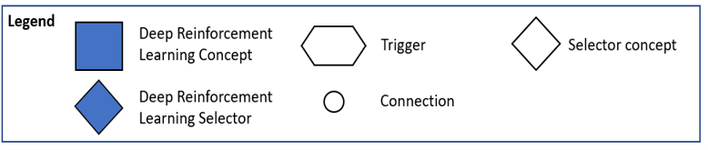
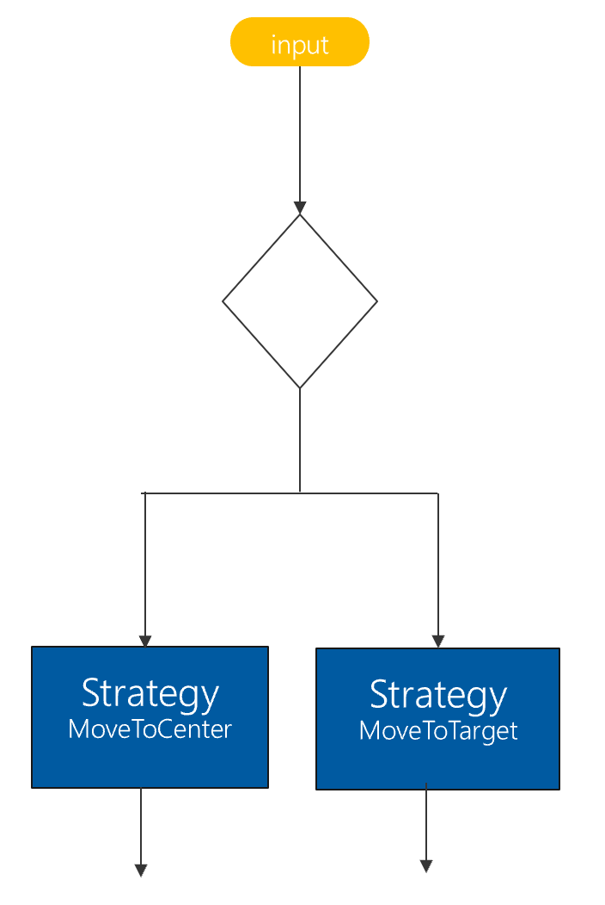
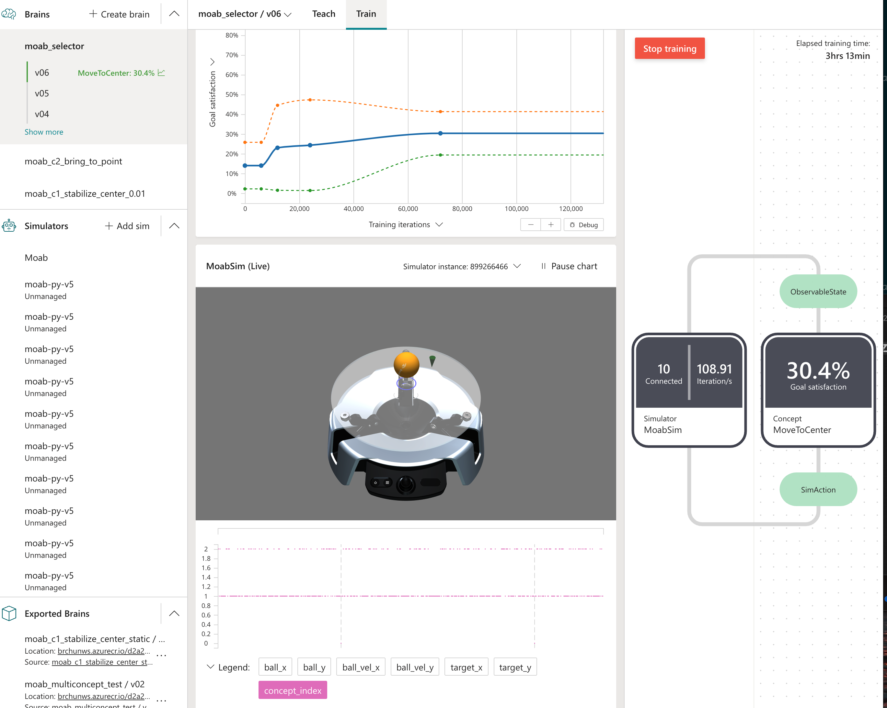

# Multi Concept Sample

A multi-concept approach illustrated on the [moab problem](https://docs.microsoft.com/en-us/bonsai/quickstart/moab/). We illustrate how to train a brain to select ('a selector') between two trained brains ('concepts') to accomplish a task. We illustrate the approach using a python simulator, exported trained brains as docker containers, and orchestration of concepts in python. 





Since multi-concept is not yet integrated with the Bonsai platform yet, the workaround is using [concept_orchestration.py](https://github.com/microsoft/multi-concept-sample/blob/main/concept_orchestration.py). Consider this as a class that provides API to utilize pre-trained exported concepts.

> 🚩 Disclaimer: This is not an official Microsoft product. This application is considered an experimental addition to Microsoft Project Bonsai's software toolchain. It's primary goal is to reduce barriers of entry to use Project Bonsai's core Machine Teaching. Pull requests for fixes and small enhancements are welcome, but we do expect this to be replaced by out-of-the-box features of Project Bonsai in the near future.

> ⚠️ Training and sim scaling with multi-concept is done on a local machine (Unmanaged) in this sample because docker containers in a container is an additional complication. 

#### TODO: 
- Be able to use bonsai sim scaling service, dockerizing (docker in docker ?)
- Test multiple control frequency (code is there, need to test functionality)
- Iterate on an multi-concept impressive demo, for now we illustrate the mechanics but not an impressive task on moab

## Pre-requisite

- We assume that the user has already trained two brains, in this example
    - Concept1
    - Concept2
- The two brains are exported as docker containers, instructions described [here](https://orange-desert-095eaeb1e.azurestaticapps.net/local-pred-cp2.html)
- install docker python api
```
pip install docker==4.2.1
```

> 🚩 Train Concept1 and Concept2 using `concept1.ink` and `concept2.ink` using the provided `Managed` simulator. This must be done before using the `main.py` in this repository.

## Launching multiple exported brain servers


When launching an exported brain docker container, user can define the root_url by specifying port **\<port>** as below. The exported brain service  will then be available at exported_brain_url = http://localhost:1111
```bash
docker run -d -p <port>:5000 <acr_name>.azurecr.io/<workspace-id>/<brain-name>:1-linux-amd64
```

In our example, we launch two exported trained brains (concept) as distinct servers on arbitrarily chosen ports **1111** and **2222**:
```bash
docker run -d -p 1111:5000 <acr_name>.azurecr.io/<workspace-id>/concept1:1-linux-amd64

docker run -d -p 2222:5000 <acr_name>.azurecr.io/<workspace-id>/concept2:1-linux-amd64
```

- Concept1 will be serving predictions at url http://localhost:1111
- Concept2 will be serving predictions at url http://localhost:2222

#### Stopping containers

Stopping all containers
```bash
docker stop $(docker ps -aq)
```

## Usage
1. concept_orchestration.py: contains the ExportedBrainPredictor(predictor_url) class which is created to serve an exported_brain running at predictor_url
2. main.py: modified for Selector to instantiate the ExportedBrainPredictors corresponding to each of the two concepts.
3. Inkling files for:
    - selector: selector.ink
    - concept1: concept1.ink
    - concept2: concept2.ink
4. Run multiple simulators locally and change purpose to Train with desired brain

Run concept_orchestration.py as a simple test (please edit main() to suit your predictor_urls and the expected state schemas)
```bash
python concept_orchestration.py
```
generates 10 random states, and get 10 actions from each of the two concepts

```
test two exported brains predictors
action from concept1: {'input_pitch': -0.06523081660270691, 'input_roll': -0.08957553654909134}
action from concept2: {'input_pitch': 0.27720528841018677, 'input_roll': -0.44016677141189575}
action from concept1: {'input_pitch': -0.06609423458576202, 'input_roll': -0.0671977773308754}
action from concept2: {'input_pitch': -0.018197907134890556, 'input_roll': -0.5506298542022705}
action from concept1: {'input_pitch': -0.0392463393509388, 'input_roll': -0.03360530361533165}
action from concept2: {'input_pitch': 0.29536348581314087, 'input_roll': -0.38922250270843506}
```
#### concept_orchestration.py: description of functionalities

concept_orchestration.py contains a class named ExportedBrainPredictor() which interfaces with an exported brain docker container via http call, below is a brief description of functionalities:

1. To create an ExportedBrainPredictor, we need to point it to a running docker server for example by defining the input *predictor_url*
```python
ExportedBrainPredictor(predictor_url='http://localhost:1111')
```
2. Once the object is instantiated, we can interact with it using the get_action() function, which simply an http request call to the exported brain docker server

```python
 def get_action(self, state: dict, iteration: int = 0) -> dict:
    """ Get action from predictor, given a state
    
    Returns
    -------
    action
    """
    exported_brain_url = '{}/v1/prediction'.format(self.predictor_url)
    if self.is_control_iteration(iteration) == True:
        response = requests.get(exported_brain_url, json = state)
        action = response.json()
    else:
        action = self.last_action
    self.last_action = action
    return action

```

### Running 1 sim locally
1. The exported brains containers must have been launched
2. The predictor_urls must match between the docker containers and main.py

register the sim with the platform
```bash
python main.py --access-key <access-key> --workspace <workspace-id>
```

> 🐧 set SIM_ACCESS_KEY and SIM_WORKSPACE as environment variables

You should now see in the Simulators section, a simulator named *moab-py-v5 - unmanaged*
Now let's connect the sim to the selector brain, which has a concept named `Select`.

```bash
bonsai simulator unmanaged connect --brain-name <brainname> --action Train --concept-name Select --simulator-name moab-py-v5
```

### Running multiple sims locally

Currently, this has only been tested by running multiple simulators locally since multiple containers inside a container is an added complication. Here is a screenshot of 10 local sims connected to brain 'Selector', with action concept_index being 1 or 2


## Moab multiconcept example: more details

In order to train the selector brain we need:
1. Two pretrained brains that serve as concept1 and concept2 (see their inkling files in concept1.ink and concept2.ink) 
2. selector's inkling file to reflect that the selector has a discrete choice between concept1 and concept 2
3. connecting to exported brains concepts on the simulator side
4. getting actions from the exported_brains_concepts on the simulator side

#### 1. Selector's inkling file
We modified its inkling to reflect the discrete selector action (1 or 2). 1 refers to the Concept or Strategy `MoveToCenter` and 2 refers to `MoveToTarget`.
```Inkling
type SimAction {
    concept_index: number<1,2,>
}
```
We commented out the simulator package, in order for the selector to wait for a local sim to be connected as opposed to running with the managed sim "Moab"
```Inkling
source simulator MoabSim (Action: SimAction, Config: SimConfig): ObservableState {}

            # Automatically launch the simulator with this
            # registered package name.
            #package "Moab"
```
#### 2. Connecting to exported brain concepts on the simulator side
In main.py's `__init__()` we create two concepts objects, in the moab sim which will point towards our two trained brains container at http://localhost:1111 and at http://localhost:2222
```python
class TemplateSimulatorSession:
    def __init__(
        self,
        modeldir: str = "sim",
        env_name: str = "Moab"
    ):
        """Simulator Interface with the Bonsai Platform
        Parameters
        ----------
        modeldir: str, optional
            directory where you sim folder lives
        env_name : str, optional
            Name of simulator interface, by default "Cartpole"
        """
        self.modeldir = modeldir
        self.env_name = env_name
        print("Using simulator file from: ", os.path.join(dir_path, self.modeldir))
        self.simulator = moab_model.MoabModel()
        C1_url = 'http://localhost:1111'
        C2_url = 'http://localhost:2222'
        self.C1 = ExportedBrainPredictor(predictor_url=C1_url, control_period=1)
        self.C2 = ExportedBrainPredictor(predictor_url=C2_url, control_period=1)
```

#### 3. getting actions from the exported_brains_concepts on the simulator side

In episode_step(), we then get the action from the corresponding concept and applying actions to sim

```python
    def episode_step(self, action: Schema):
        # use new syntax or fall back to old parameter names
        if action.get('concept_index') == 1: # selector
            action = self.C1.get_action(
                self.get_state()
                )
        else:
            action = self.C2.get_action(
                self.get_state()
                )
        
        self.model.roll = action.get(
            "input_roll", 
            self.model.roll
            )
        self.model.pitch = action.get(
            "input_pitch", 
            self.model.pitch
            )
```

## Contribute Code
This project welcomes contributions and suggestions. Most contributions require you to
agree to a Contributor License Agreement (CLA) declaring that you have the right to,
and actually do, grant us the rights to use your contribution. For details, visit
https://cla.microsoft.com.

When you submit a pull request, a CLA-bot will automatically determine whether you need
to provide a CLA and decorate the PR appropriately (e.g., label, comment). Simply follow the
instructions provided by the bot. You will only need to do this once across all repositories using our CLA.

This project has adopted the [Microsoft Open Source Code of Conduct](https://opensource.microsoft.com/codeofconduct/).
For more information see the [Code of Conduct FAQ](https://opensource.microsoft.com/codeofconduct/faq/)
or contact [opencode@microsoft.com](mailto:opencode@microsoft.com) with any additional questions or comments.

## Telemetry
The software may collect information about you and your use of the software and send it to Microsoft. Microsoft may use this information to provide services and improve our products and services. You may turn off the telemetry as described in the repository. There are also some features in the software that may enable you and Microsoft to collect data from users of your applications. If you use these features, you must comply with applicable law, including providing appropriate notices to users of your applications together with a copy of Microsoft's privacy statement. Our privacy statement is located at https://go.microsoft.com/fwlink/?LinkID=824704. You can learn more about data collection and use in the help documentation and our privacy statement. Your use of the software operates as your consent to these practices.

## Trademarks
This project may contain trademarks or logos for projects, products, or services. Authorized use of Microsoft trademarks or logos is subject to and must follow Microsoft's Trademark & Brand Guidelines. Use of Microsoft trademarks or logos in modified versions of this project must not cause confusion or imply Microsoft sponsorship. Any use of third-party trademarks or logos are subject to those third-party's policies.